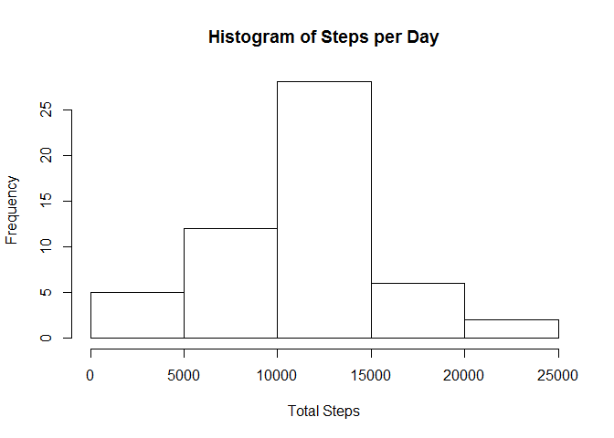

# Reproducible Research: Peer Assessment 1


## Loading and preprocessing the data

Check to see if the csv file is already present in the working directory and
if not, unzip from the current directory (zip is assummed to be present).  csv
is then read into the AMD (Activity Monitoring Data) variable.


```r
if (!file.exists("activity.csv")) {
    unzip("activity.zip")
}

AMD <- read.csv("activity.csv")
```


## What is mean total number of steps taken per day?

Aggregate the steps by day and then produce a histogram showing the frequency
of steps for a day given the sample data.  Next, calc the mean and median.


```r
steps_per_day <- aggregate(steps ~ date, data = AMD, sum, na.rm = TRUE)
hist(steps_per_day$steps, main = "Histogram of Steps per Day", xlab = "Total Steps")
```

 

```r
mean_steps <- mean(steps_per_day$steps)
median_steps <- median(steps_per_day$steps)
```

The mean number of steps per day is 1.0766189\times 10^{4} and the median steps per day 
is 10765.

## What is the average daily activity pattern?


## Imputing missing values


## Are there differences in activity patterns between weekdays and weekends?
